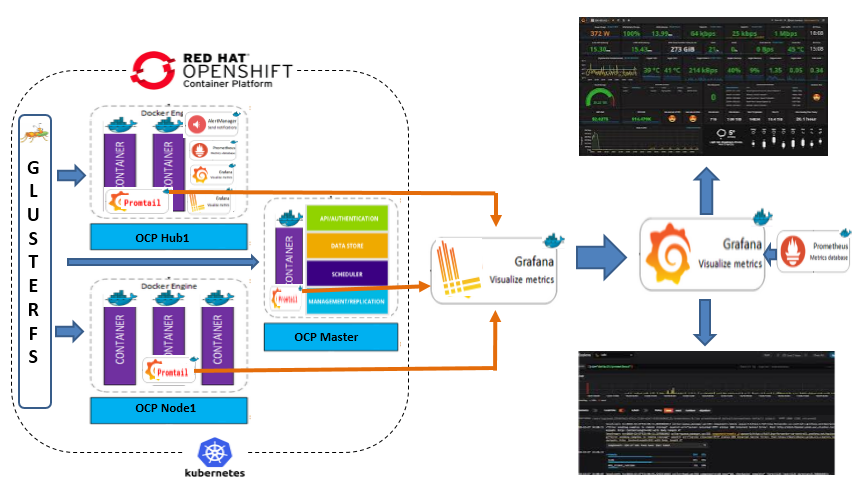
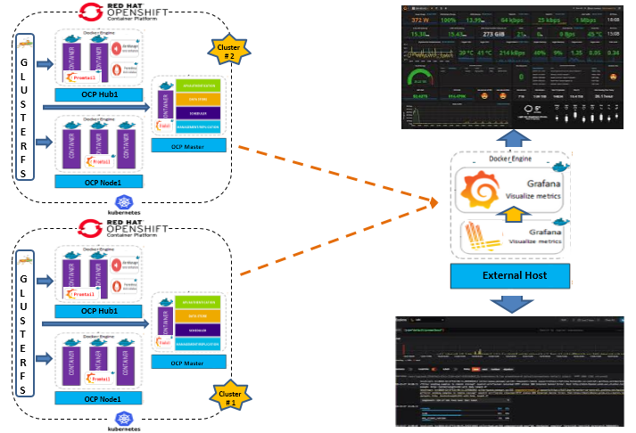

# Openshift logging with Loki
Loki is a logging backend optimized for users running Prometheus and Kubernetes with great logs search and visualization in Grafana 6.0.

Loki was built for efficiency alongside the following goals:

- Logs should be cheap. Nobody should be asked to log less.
- Easy to operate and scale.
- Metrics, logs (and traces later) need to work together.

## Loki components
Loki is a TSDB (Time-series database), it stores logs as split and gzipped chunks of data.

The logs are ingested via the API and an agent, called Promtail (Tailing logs in Prometheus format), will scrape Kubernetes logs and add label metadata before sending it to Loki.

This metadata addition is exactly the same as Prometheus, so you will end up with the exact same labels for your resources.

## Logging architecture within container platform



### Install Loki & Promtail in Openshift

```
oc new-project loki
oc adm policy add-scc-to-user privileged system:serviceaccount:loki:promtail
oc adm policy add-scc-to-user anyuid system:serviceaccount:loki:promtail
oc adm policy add-scc-to-user anyuid system:serviceaccount:loki:loki
oc patch namespace loki -p '{"metadata":{"annotations":{"openshift.io/node-selector":""}}}'
oc create -f promtail-account.yaml
oc create -f promtail-configmap.yaml
oc create -f promtail-daemonset.yaml

oc create -f loki-account.yaml
oc create -f loki-pvc.yaml
oc create secret generic loki-secret --from-file=loki-config.yaml=loki-config.yaml
oc create -f loki-stateful.yaml
oc create -f loki-service.yaml
oc expose service/loki
```

## Logging architecture outside of container platform



### Install Loki outside of Openshift

```
mkdir /root/loki
mkdir /root/loki-data


chcon -Rt svirt_sandbox_file_t /root/loki
chcon -Rt svirt_sandbox_file_t /root/loki-data
cp loki-config.yaml /root/loki/
docker run -d --name loki -p 3100:3100 --restart=always -v /root/loki:/etc/loki -v /root/loki-data:/data grafana/loki -config.file=/etc/loki/loki-config.yaml
```

### Install Promtail in Openshift
```
oc new-project loki
oc adm policy add-scc-to-user privileged system:serviceaccount:loki:promtail
oc adm policy add-scc-to-user anyuid system:serviceaccount:loki:promtail
oc patch namespace loki -p '{"metadata":{"annotations":{"openshift.io/node-selector":""}}}'
oc create -f promtail.yaml
```

## Add Loki datasource in Grafana (Supported Grafana version 6.0 & onwards)

- Log into your Grafana.
- Go to Configuration > Data Sources via the cog icon in the left sidebar.
- Click the big + Add data source button.
- Choose Loki from the list.
- The http URL field should be the address of your Loki server: http://loki-host:3100 

## See your logs in the “Explore” view
- Select the “Explore” view on the sidebar.
- Select the Loki data source.
- Choose a log stream using the “Log labels” button.

